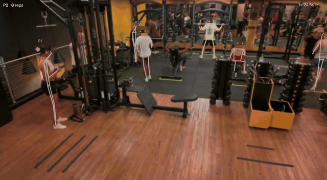
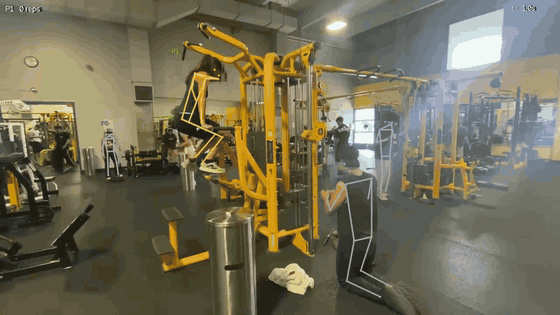
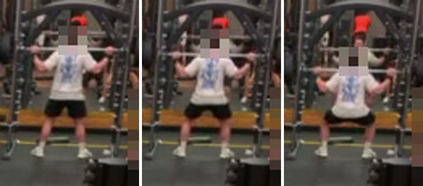
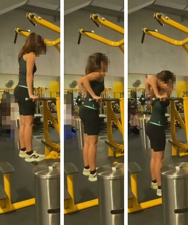
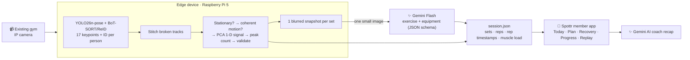

<div align="center">

# Spottr ⚡️

### Your gym already has cameras. Now they count your reps.

Spottr turns ordinary gym security cameras into an automatic workout tracker.<br>
No wearables, no phone, no app to open mid-set. Members lift, and every set, rep and muscle worked lands in their log.

<br>


**Built in 3 hours at the [Berkeley × Google DeepMind Hackathon](#-hackathon) · Sept 27, 2026**

</div>

---

## 🎬 See it work on real gym footage

Both clips are unedited phone recordings from real, crowded gyms, run end to end through the pipeline.
Green skeleton = person in an active set · `+1` flashes on each counted rep · faces are pixelated automatically.

<table>
<tr>
<th width="50%">Example 2 · Smith-machine squat in a crowd</th>
<th width="50%">Example 3 · Bodyweight dips</th>
</tr>
<tr>
<td>
<a href="docs/media/example-2-squat.mp4"></a>
</td>
<td>
<a href="docs/media/example-3-dips.mp4"></a>
</td>
</tr>
<tr>
<td align="center"><a href="docs/media/example-2-squat.mp4"><b>▶ Full 73 s clip (MP4)</b></a></td>
<td align="center"><a href="docs/media/example-3-dips.mp4"><b>▶ Full 38 s clip (MP4)</b></a></td>
</tr>
<tr>
<td>

| | |
|:--|:--|
| **People tracked** | 27 over the clip, 1 doing sets |
| **Detected** | 1 set · **5 reps** · squat |
| **Equipment** | Smith machine (Gemini) |
| **Label confidence** | 0.95 |
| **Rep period** | 3.5 s · regularity 0.97 |
| **Ground truth** | 5 reps (manual frame-by-frame count) |

</td>
<td>

| | |
|:--|:--|
| **People tracked** | 11 over the clip, 1 doing sets |
| **Detected** | 1 set · **10 reps** · dip |
| **Equipment** | Bodyweight (Gemini) |
| **Label confidence** | 0.95 |
| **Rep period** | 3.3 s · regularity 0.95 |
| **Ignored** | people walking, stretching and kneeling nearby |

</td>
</tr>
</table>

> The squatter is small, at the back of a 640×352 frame, behind racks and other members. Spottr still finds the only person doing sets, counts all 5 reps (rep bottoms within 0.1 s of the manual count), and rejects 4 false candidates: someone standing next to a bench presser, a member drinking water, and two heavily occluded tracks.

### What Gemini actually sees

The camera stream never leaves the gym. For each detected set, the edge device sends Gemini **one small, blurred image**: three frames of a single rep (start → halfway → furthest point), cropped around the lifter, with their face pixelated and every other person blurred head to toe. Gemini returns the exercise and equipment as structured JSON.

<table>
<tr>
<td width="62%"></td>
<td width="38%"></td>
</tr>
<tr>
<td align="center"><code>{"exercise": "squat", "equipment": "smith_machine", "confidence": 0.95}</code></td>
<td align="center"><code>{"exercise": "dip", "equipment": "bodyweight", "confidence": 0.95}</code></td>
</tr>
</table>

---

## 💡 The idea

**Problem.** Most gym members don't log their workouts. Tracking apps need you to type between sets, and wearables are poor at counting strength reps. Gyms already pay for camera coverage of the whole floor, and that footage is only used for security.

**Solution.** A small edge box (Raspberry Pi 5) plugs into the gym's existing IP cameras. It tracks every member's pose, finds who is doing sets, counts reps, and uses Gemini to name the exercise. Members get an automatic workout log with sets, reps, volume and a muscle-recovery map, with nothing to wear and nothing to type.

**Why it's different**

- **Zero hardware for members.** The gym already has the cameras, so the only new hardware is one edge device per camera zone.
- **Exercise-agnostic counting.** Reps are found from coherent joint motion, not per-exercise rules, so a new exercise needs no new code. The label never affects the count.
- **Private by design.** Pose runs on the edge. Only one blurred snapshot per set goes to Gemini (lifter's face pixelated, everyone else head to toe), never the video stream. The replay blurs everyone but you too.
- **Works on bad footage.** Built and tuned on real, crowded, low-resolution gym video, not staged single-person clips.

**Who pays.** Gyms and gym chains: a member-experience and retention feature on top of cameras they already own, plus floor analytics like equipment usage and peak hours.

---

## 🏗️ How it works



### Rep counting in six steps ([`backend/vision/analyze.py`](backend/vision/analyze.py))

1. **Stitch** tracks the tracker split when someone walks in front: a new ID appearing where an old one vanished within 3 s, at a similar size, is the same person.
2. **Stationary filter.** Feet move less than 0.25 body-heights/s for at least 4 s (walking is about 0.7).
3. **Coherent motion.** Keypoints are normalised by body height, slow drift is removed, and the top eigenvalue of a 2.5 s sliding covariance is measured. Many joints moving together means a rep; independent jitter means noise.
4. **PCA → 1-D signal** per active window, oriented so the rep extreme is a peak.
5. **Peaks** (prominence ≥ 35 % of range, ≥ 0.7 s apart) are reps.
6. **Validate** each set: at least 3 reps, autocorrelation at the rep period ≥ 0.4 (removes fidgeting and gestures), a joint travelling ≥ 0.10 body-heights, and feet staying put.

### Where Gemini is used

| | Where | What it does |
|:--|:--|:--|
| **Exercise recognition** | [`backend/vision/classify.py`](backend/vision/classify.py) | Gemini Flash reads a 3-frame strip of one rep (lifter's face and all bystanders blurred) and returns `exercise`, `equipment` and `confidence`, constrained to our 26-exercise vocabulary by a JSON response schema. |
| **AI coach recap** | [`vite.config.ts`](vite.config.ts) → `/api/recap` | Server-side Gemini call that turns the verified session (exercises, reps, duration) into a short, personalised workout recap in the member app. |

---

## 📊 Results

| | |
|:--|:--|
| Squat clip (Example 2) | **5 / 5 reps**, matching a manual frame-by-frame count, rep bottoms within 0.1 s |
| Dip clip (Example 3) | **10 reps** across one 31.6 s set |
| False positives on the demo clips | 0 counted sets; 4 false candidates rejected in the squat clip |
| Synthetic test suite | **16 / 16**: curls, presses, squats, lateral raises, 1–5 s tempo, jitter, 60 px people, 20 % keypoint dropout, occlusion, unrack/re-rack, touch-and-go reps, walkers, fidgeting, multi-set, crowd |
| Speed | 21.8 fps on an M1 (YOLO26n-pose @ 960 px + BoT-SORT/ReID); 13–14 fps on the demo clips. Analysis takes < 1 s per minute of video |

**Known limits.** A person hidden behind equipment isn't detected at 640×352 by any pose model size we tried, so film at 1080p with the lifter taking up at least ¼ of the frame height. Identity across long occlusions or multiple cameras isn't solved yet.

---

## 📱 The member app

The React front end is what a gym member sees after training:

- **Today:** the auto-logged workout and the Gemini coach recap
- **Plan:** a weekly training plan with the workouts logged so far
- **Recovery:** a body heat map of muscle load (from `muscle_load` in `session.json`) and readiness per muscle group
- **Progress / Workouts:** volume trends and workout history
- **Replay:** the real demo clips with pipeline skeletons drawn live over the video, a person picker, and a rep counter that ticks on each detected rep

---

## 🚀 Quickstart

**Web app**

```bash
npm install
npm run dev          # http://localhost:3000
```

Put `GEMINI_API_KEY=...` in `.env` to enable the AI coach recap. Without a key, the app falls back to a built-in recap.
The Replay screen plays the real clips in `public/videosCorrect/` with pipeline output from `public/demo-data/` (clip list in `src/config.ts` → `PIPELINE_CLIPS`).

**Vision pipeline** (Python 3.12)

```bash
cd backend
python3.12 -m venv .venv && .venv/bin/pip install -r requirements.txt
.venv/bin/python -m vision.run path/to/clip.mp4        # -> out/clip/{session.json, overlay.json, annotated.mp4}
.venv/bin/python -m vision.run clip.mp4 --no-gemini    # heuristic labels, no API key needed
.venv/bin/python tests/test_reps.py                    # synthetic rep-counter suite
```

**On a Raspberry Pi**

```bash
.venv/bin/yolo export model=models/yolo26n-pose.pt format=ncnn imgsz=640
.venv/bin/python -m vision.run clip.mp4 --model models/yolo26n-pose_ncnn_model --imgsz 640 --device cpu
```

Everything after pose tracking is numpy/scipy only. See [`backend/README.md`](backend/README.md) for the output format and filming guidelines.

---

## 📁 Repository layout

```
├── backend/vision/        # Python pipeline: track → analyze → classify (Gemini) → render
│   ├── track.py           #   YOLO26n-pose + BoT-SORT/ReID, 17 keypoints per person per frame
│   ├── analyze.py         #   stitching, set detection, exercise-agnostic rep counting
│   ├── classify.py        #   bystander/face blurring + Gemini exercise/equipment labelling
│   ├── exercises.py       #   exercise vocabulary + muscle-load weights
│   └── render.py          #   annotated.mp4 + overlay.json for the web replay
├── backend/tests/         # synthetic rep-counter test suite
├── public/demo-data/      # pipeline output for the demo clips (sessions, skeletons, thumbnails)
├── public/videosCorrect/  # demo clips (crowd, squat, dip)
├── docs/media/            # README videos, GIFs and Gemini input snapshots
├── src/                   # React 19 + Vite member app
│   ├── components/        #   Today, Plan, Recovery, Progress, Workouts, Replay, BodyMap
│   └── services/          #   pipeline adapter, tracking, rep counter, summary/recap
└── vite.config.ts         # /api/recap: server-side Gemini route
```

---

## 🏆 Hackathon

Built at the **Berkeley × Google DeepMind Hackathon** (with Girls into VC @ UC Berkeley), Sept 27, 2026, during a 3-hour build sprint, for the Google AI Studio track.

**Team:** [@MamamaMartin](https://github.com/MamamaMartin) · [@felixmlgl](https://github.com/felixmlgl) · [@gardlae](https://github.com/gardlae)
